# Triad — Product Overview

Triad is a dating and social discovery app built for a modern reality: not everyone is a single person looking for another single person. Triad is designed for **singles, couples, and group-aware connection** — letting people find compatible matches regardless of their relationship structure.

---

## Who is Triad for?

- **Singles** looking for a partner, a couple, or a meaningful connection
- **Established couples** who want to explore connections together as a unit
- **Anyone** who wants to meet people at real local events, not just swipe endlessly

---

## The Core Idea

Most dating apps assume everyone is a single individual. Triad doesn't. A couple can create a shared profile, browse as a unit, and match with singles or other couples. The experience is built around **genuine self-expression** — profile photos, an audio bio you record in your own voice, short video highlights — and **intentional discovery** rather than infinite swiping.

---

## Getting Started

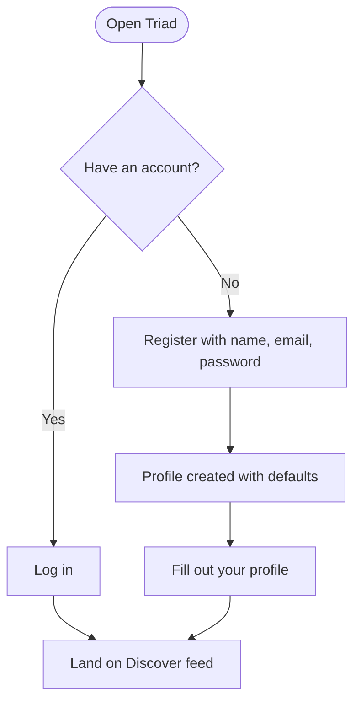

When you first sign up, Triad creates your profile with a default avatar. Before you start discovering others, you're encouraged to complete your profile so that people you encounter see the real you.

---

## Your Profile

Your profile is your identity on Triad. It's rich and expressive by design.

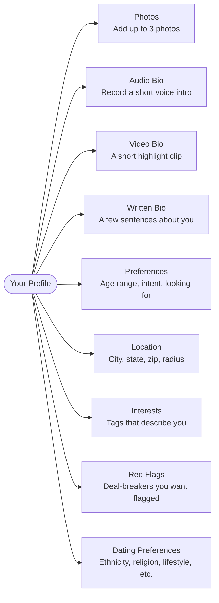

### Couple Profiles

If you're part of a couple, one partner creates a couple account and shares an invite code with the other. Once both join, your profile represents you both. You browse and match together.

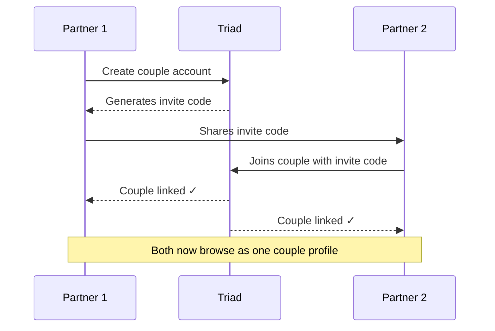

---

## Discovery

The Discover tab is where you find people. Triad shows you cards — one at a time — from people near you.

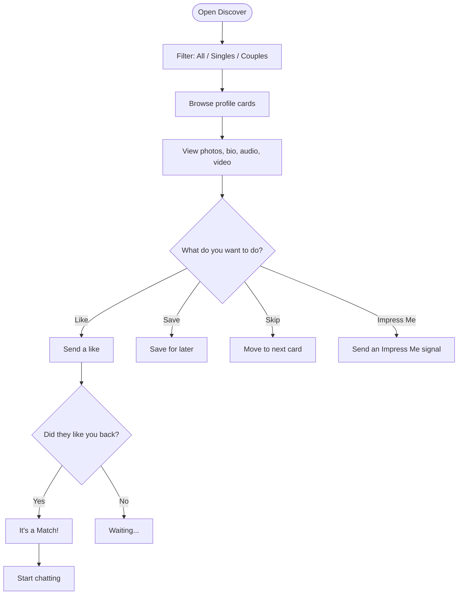

Discovery is location-aware. You set a radius on your profile, and Triad only surfaces people within that distance. People you've already liked, saved, or blocked never appear again.

---

## Likes & Matching

Triad uses mutual interest to unlock conversation. You like someone, they like you back — that's a match.

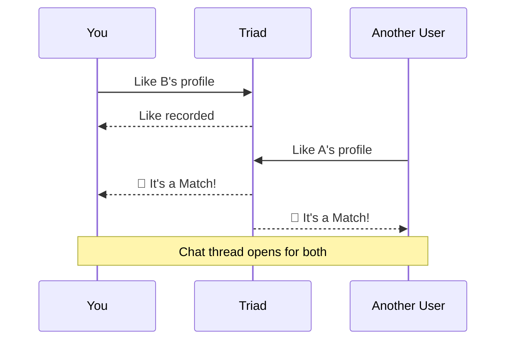

Couple-to-single and couple-to-couple matches are fully supported. When a couple matches with someone, the chat includes all members.

---

## Chat

Once matched, you and your match can chat directly inside the app. Messages are delivered in real time.

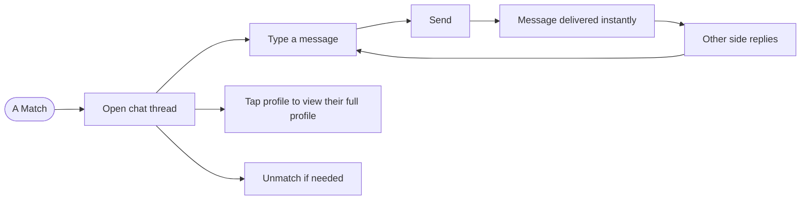

---

## Saved Profiles

Not ready to like someone yet? Save them. The Saved tab is your personal shortlist — people you want to come back to.

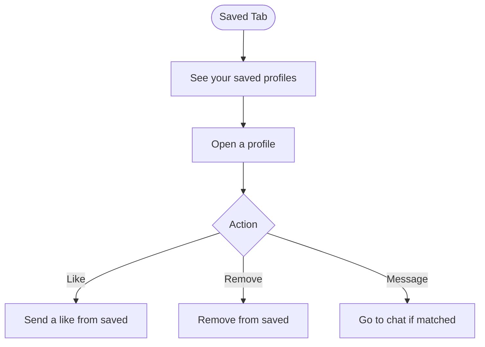

---

## Impress Me

Impress Me is Triad's way of breaking the ice before — or after — a match. Instead of a cold like, you can send a signal with a personal prompt. The other person responds, and if it sparks something, you can take it further.

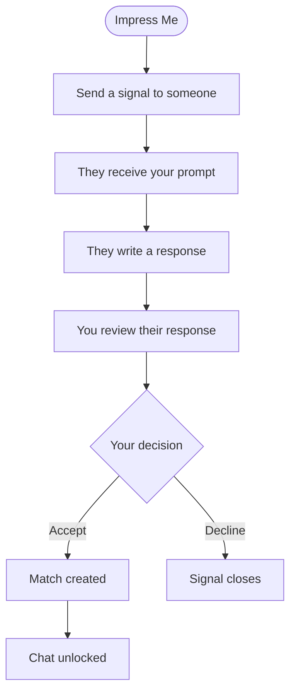

Impress Me works both before a match as a warm intro, and after a match as a conversation starter. It's built into your Impress tab in the app.

---

## Events

Triad connects you to real-world events happening near you — curated experiences where you might meet people in person, not just on a screen.

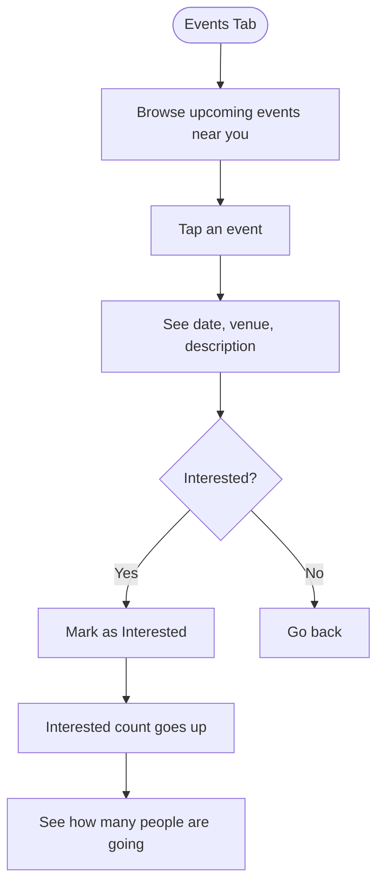

Events are sorted by date and filtered by your location. You can toggle your interest on and off at any time.

---

## Safety

Triad takes safety seriously. If someone makes you uncomfortable, you have tools to protect yourself.

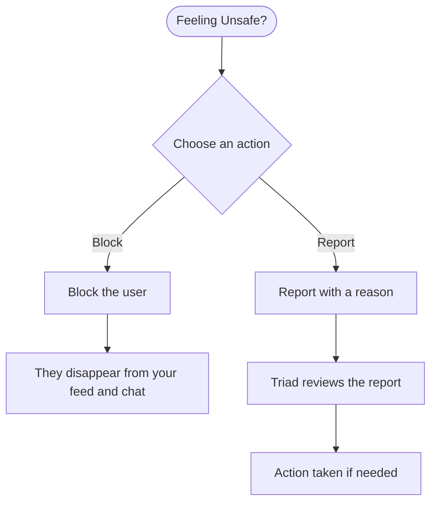

- **Blocking** someone removes them from your discovery feed, saved list, and any shared chats immediately.
- **Reporting** sends the account for review. You can include a reason and any extra detail.
- Triad also automatically detects and limits spam-like behaviour in messages and profile content.

---

## Red Flags

When you set red flags on your profile — things that are genuine deal-breakers for you — Triad highlights them when they appear in someone else's interests. It's a quiet, automatic heads-up so you can make more informed decisions without it feeling confrontational.

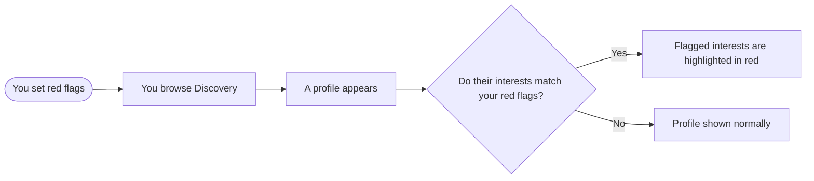

---

## Full User Journey

Here's the end-to-end experience from the moment someone downloads Triad to having a real conversation.

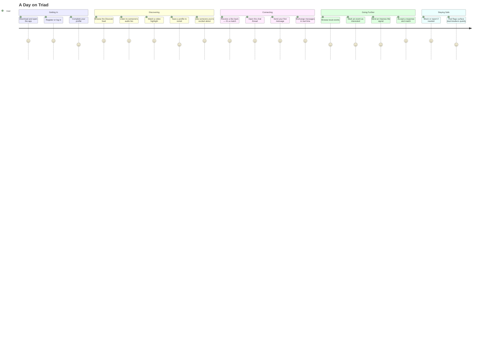

---

## Key Principles

**Inclusive by design.** Singles and couples are first-class citizens. The app adapts to your relationship structure, not the other way around.

**Expression over swiping.** Audio bios, video highlights, and rich preferences give people a real sense of who you are before any conversation starts.

**Safety first.** Blocking, reporting, anti-spam, and red flag detection are built into every layer of the experience.

**Real-world connection.** Events bring the app into the physical world, creating opportunities to meet in person with shared context.
