# Triad Product Overview

Triad is a dating and social discovery product built for a reality most platforms flatten away: some people date solo, some date as a couple, and some conversations need to stay group-aware from the very first interaction. Triad treats those cases as part of the core product instead of edge conditions.

## Product Thesis

Triad is currently shaped around five product beliefs:

- singles and couples should both fit naturally into discovery, matching, and messaging
- a profile should feel more expressive than a photo card and one-line bio
- intent should have softer states than just swipe left or swipe right
- trust should be visible through verification and safety signals
- online discovery should connect to real-world interaction, not replace it

## Who The Product Is For

Triad is currently designed for:

- singles looking for other singles or couples
- couples who want to browse and match together
- users who want more personality and context before opening a chat
- users who want both app-based discovery and local event-based connection
- local businesses who want to engage with a dating-aware audience through events, offers, and challenges

## Current Product Shape

The live product in this repo has five main surfaces:

- a backend-first platform in `ThirdWheel.API` that defines product behavior
- a native SwiftUI iOS app that is the primary user-facing client in this repo
- a responsive consumer web app that mirrors the iOS product flows
- a business partner portal for event and offer management
- a lightweight admin dashboard for internal user, moderation, and geography views

The consumer product is centered on the iOS app and API. The admin dashboard is operational support, not a primary end-user experience.

## Core Experience

### 1. Account Creation And Session

Users register and log in with email and password. Successful authentication issues a JWT-backed session, and the iOS app persists that session in Keychain so returning users can re-enter the signed-in flow without logging in every launch.

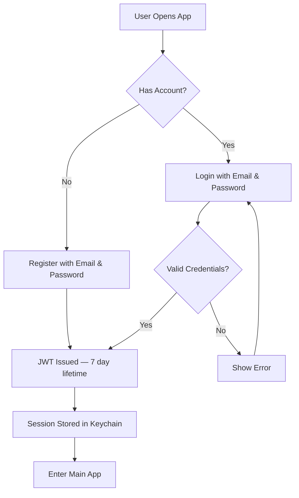

### 2. Rich Profiles

Triad profiles are intentionally broader than a swipe card. A profile can currently include:

- written bio
- age range, intent, and looking-for preference
- city, state, zip, coordinates, and radius
- interests
- red flags
- audio bio
- up to 5 photos
- up to 3 ordered video highlights
- detailed compatibility and lifestyle fields such as ethnicity, religion, relationship type, children, family plans, smoking, drinking, politics, education, physique, sexual preference, and comfort with intimacy

The goal is to make first impressions feel more human and more legible before a conversation starts.

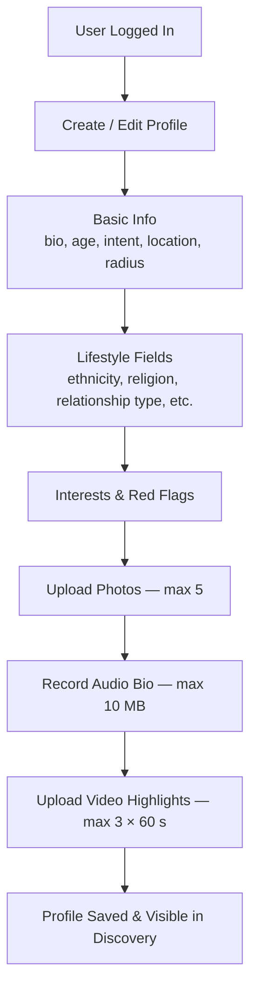

### 3. Couple Accounts

Couple support is a defining part of the product. One partner can create a couple record, receive an invite code, and have the second partner join. Once linked, Triad can treat that relationship as a couple-aware profile in discovery, matching, and messaging.

This is not framed as two people sharing a generic account. The product logic understands that a match may involve more than one participant on one side of the connection.

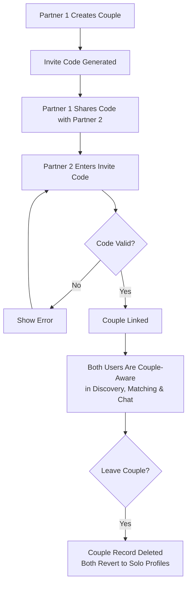

### 4. Discovery

Discovery is the main browsing surface. Users can currently:

- browse nearby profiles
- filter between all users, singles, and couples
- apply a distance cap
- open full profile detail
- like, save, or skip
- use Impress Me as an alternate opening path

The current backend also excludes blocked profiles and avoids repeatedly surfacing already actioned profiles, which helps the feed stay cleaner and more intentional.

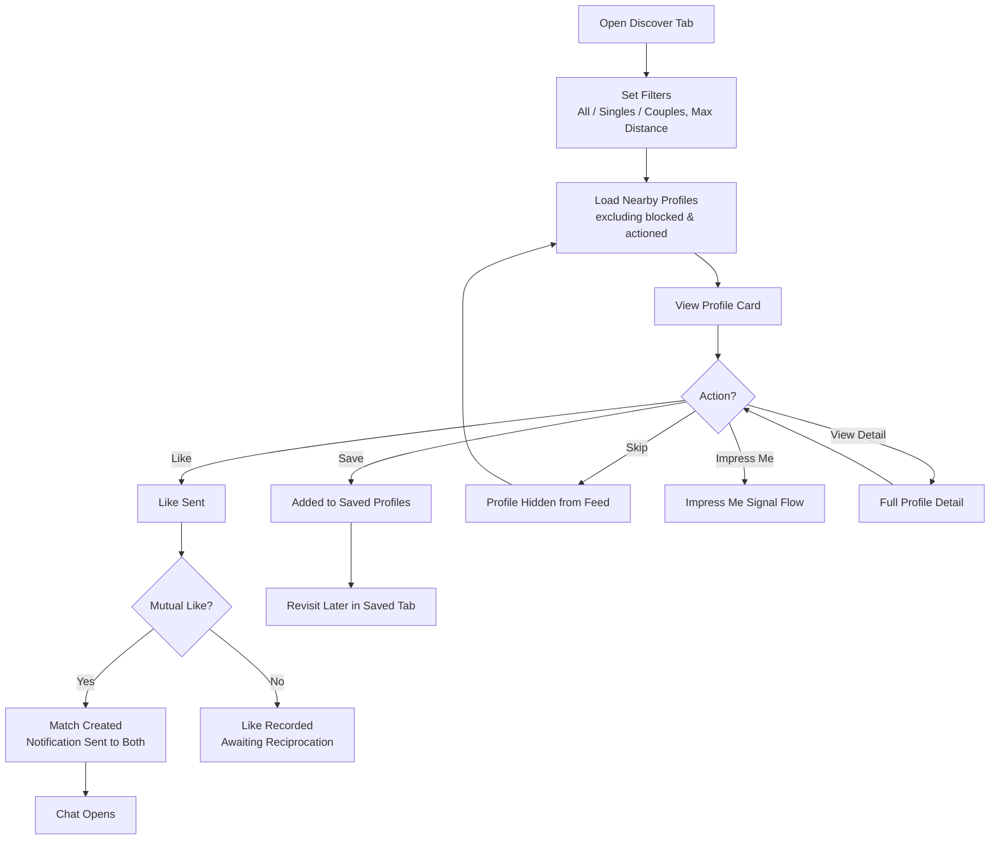

### 5. Saved Profiles

Saved Profiles is the product's softer intent layer. It gives users a middle state between acting immediately and losing someone in the feed.

Users can:

- save from discovery
- revisit saved people later
- open full profile detail from the saved list
- like or remove from the saved list

This makes the product feel less disposable than a pure swipe mechanic.

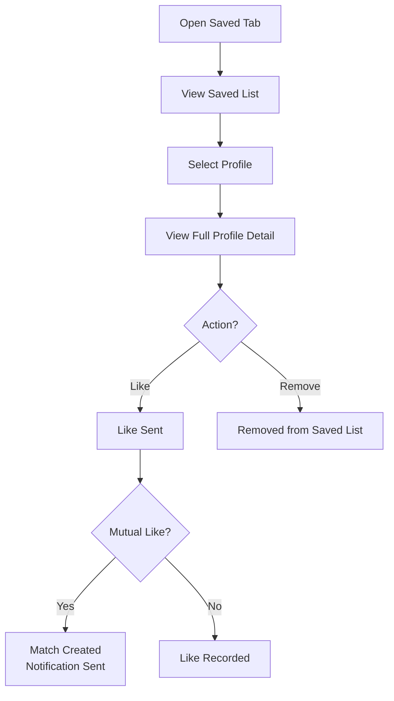

### 6. Likes, Matches, And Chat

A mutual like creates a match. After that, users can message through the app.

The current experience includes:

- a match list
- per-match message history
- real-time chat through SignalR
- REST-backed message loading and sending
- unmatch support
- group-aware participation when a couple is part of the match

That last point matters. If a couple is involved, the resulting connection is treated as a shared interaction rather than forcing the product back into a purely one-to-one model.

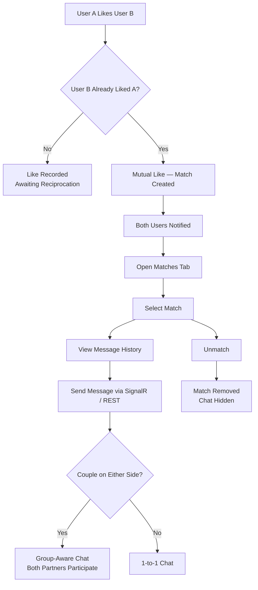

### 7. Notifications

Triad includes an in-app notification layer so activity still feels alive when a user is not actively browsing.

Users currently receive notifications for:

- likes received
- new matches
- new messages
- Impress Me challenges

The iOS app surfaces unread counts, notification inbox access, per-item mark-read actions, and a mark-all-read action.

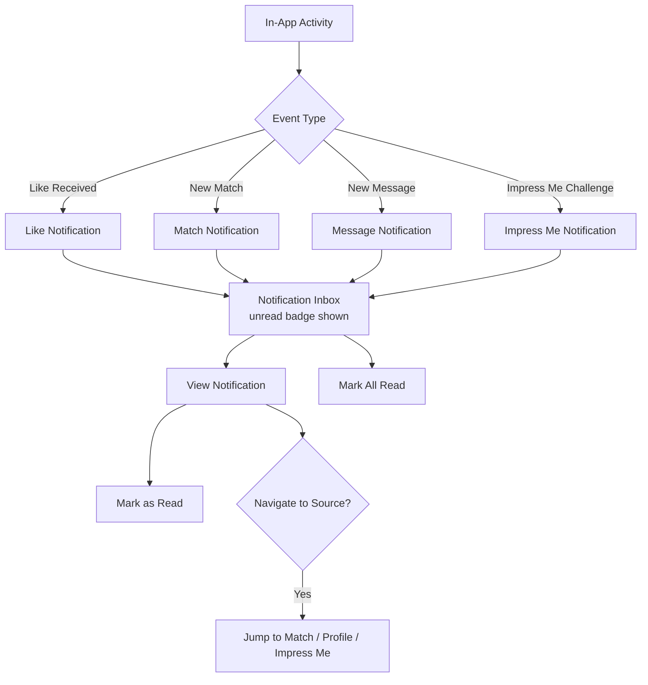

### 8. Impress Me

Impress Me is Triad's prompt-response interaction system. It gives the product a warmer opening than a plain like and can also be used after a match as a conversation nudge.

The current flow supports:

- sending a signal
- inbox views for sent and received activity
- summary and badge counts
- receiver responses
- sender review
- sender accept or decline actions
- both pre-match and post-match usage

In the strongest version of the flow, Impress Me creates a lightweight challenge-response before chat opens, which makes first contact feel more personal and more intentional.

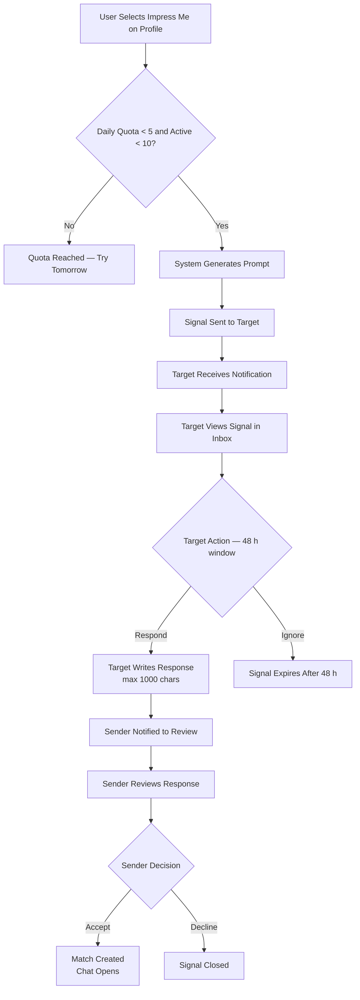

### 9. Verification And Trust

Triad now has a verification framework that goes beyond a single badge toggle. The system tracks eligibility, start and completion attempts, current status, failure reasons, verified timestamps, expiry where relevant, and profile-facing badge state.

Configured verification methods currently include:

- live verification
- age verification
- phone verification
- couple verification
- partner consent verification
- intent verification
- in-person verification
- social verification

The backend framework is broader than the current iOS presentation surface. The API already supports the full registry above, while the native profile experience currently exposes the verification layer in a more limited way.

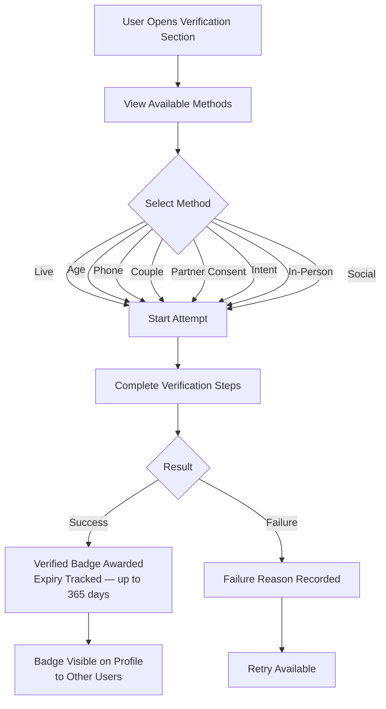

### 10. Events

Triad is not only screen-first. The events layer gives the product a local, real-world extension.

Users can currently:

- browse upcoming events
- view venue, location, and date details
- see distance when location data is available
- mark or remove interest
- claim offers attached to events
- respond to business-created challenges

Events are filtered against the user's effective discovery radius when both sides have usable coordinates.

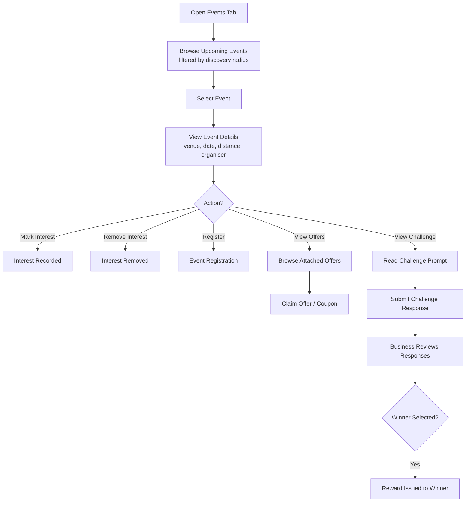

### 11. Safety

Safety is embedded in the main product loop rather than hidden in settings.

Current safety features include:

- blocking
- unblocking
- reporting with a reason and optional detail
- anti-spam checks on profile and message content
- red-flag highlighting in profile detail

The intended user outcome is simple: unwanted or unsafe interactions should be easy to stop and hard to resurface.

```mermaid
flowchart TD
    A[User Views Profile or Receives Message] --> B{Safety Action?}
    B -->|Block| C[Block User]
    C --> D[Blocked User Removed from Feed & Chat]
    D --> E[No Further Interactions Possible]
    E --> F{Unblock Later?}
    F -->|Yes| G[Block Removed\nUser May Reappear in Feed]
    B -->|Report| H[Select Report Reason]
    H --> I[Add Optional Detail]
    I --> J[Report Submitted]
    J --> K[Admin Review Queue]
    J --> L[Anti-Spam Strike Tracked\n3 strikes triggers ban]
```

## Business Partner Platform

The business partner layer is an additional product surface aimed at local venues and event organisers. It extends the app into real-world experiences without changing the consumer dating product.

### Business Partner Flow

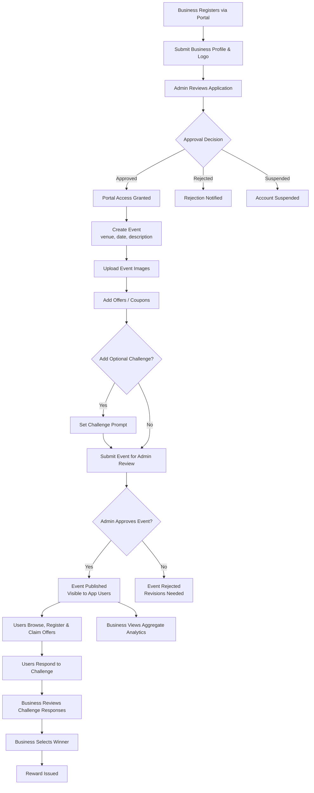

### What Business Partners Can Do

Business partners interact with the platform through a dedicated portal. Current capabilities include:

- register a business and await approval
- manage a business profile with logo and category
- create, edit, and submit events for admin approval
- attach image galleries to events
- add offers and coupon codes to events
- optionally set a challenge prompt on an event
- review user challenge responses and select a winner
- issue rewards to challenge winners
- view aggregate analytics on event engagement

## Consumer Web App

`web/triad-web` is a responsive consumer-facing web app that mirrors the iOS product flows for desktop, tablet, and mobile web. It is built on Next.js App Router, React, TypeScript, and Tailwind CSS.

Current consumer web routes include: auth, discover, saved, matches and chat, Impress Me, events, notifications, profile, profile editing, and public profile detail.

Some native-only workflows — rich media upload, audio/video playback, and real-time SignalR chat — are partially completed or carry explicit TODO banners in the web surface. The iOS app remains the primary end-to-end client.

## Marketing Website

`web/triad-site` is the public-facing marketing website. It is a standalone Next.js app with Framer Motion animations and covers: brand landing, feature highlights, safety information, download links, business partner CTAs, and a waitlist or contact form.

The marketing site does not expose product workflows or admin links.

## Current iOS App Shape

The native app currently centers on:

- Discover
- Saved
- Matches
- Impress Me
- Events via the tab shell
- Notifications and Profile from the top-right navigation area

The profile flow is now a fuller dedicated experience rather than a minimal modal. It includes editing for location, preferences, interests, red flags, media, and verification-aware profile details.

## Operational Surface

The repo also contains a lightweight admin dashboard used for internal visibility. It focuses on:

- admin-safe user summaries
- online user visibility
- moderation analytics
- coarse geography analytics
- pending business partner approvals
- pending business event, offer, and challenge approvals
- business audit history

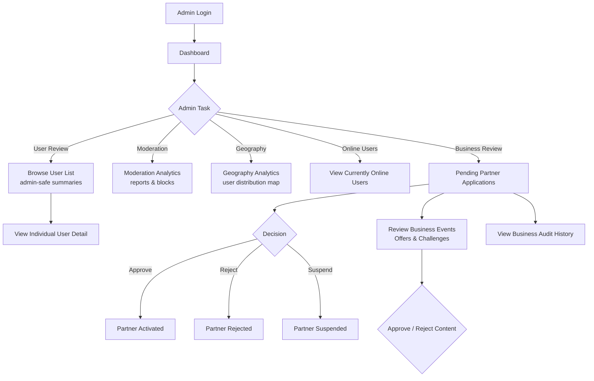

This is important to the product's day-to-day operation, but it is not part of the core consumer experience or brand promise.

## Current Business Rules

Important product and platform limits currently include:

- JWT session lifetime: 7 days
- global API rate limit: 120 requests per 60 seconds per IP
- max likes per day: 50
- max profile photos: 5
- max profile videos: 3
- max audio bio size: 10 MB
- max video size: 50 MB
- max video duration: 60 seconds
- bio max length: 500 characters
- message max length: 2000 characters
- anti-spam strike threshold: 3
- repeated-message trigger: 3 identical messages within 5 minutes
- Impress Me daily quota: 5
- Impress Me max active outbound signals: 10
- Impress Me response max length: 1000 characters
- Impress Me expiry: 48 hours
- live verification expiry: 365 days
- age verification expiry: 365 days

## What Makes The Current Build Distinct

Triad's differentiation does not come from one isolated feature. It comes from the combination of:

- couple-aware discovery and group-aware chat
- richer self-expression through audio, video, and detailed preferences
- softer intent states through saving and Impress Me
- a visible trust layer through verification and safety signals
- a real-world extension through local events and a business partner ecosystem

The current build is aiming to feel more flexible, more expressive, and more intentional than a traditional swipe-only product while still keeping the main dating loops familiar enough to use quickly.

## Current Reality Check

The repo is meaningfully beyond a prototype, but it is still an actively evolving product. A few realities matter:

- the backend is broader than the iOS surface in some areas, especially verification and operational tooling
- the iOS app is the primary client in this repo; the consumer web app mirrors the flows but some native-only media and realtime features are incomplete there
- the admin dashboard is useful and real, but still lightweight
- the business partner portal is MVP-level; production completeness for auth edge cases, analytics depth, and approval workflow polish should be validated
- `plan.md` in the repo root contains a detailed microservice migration roadmap (strangler-fig, YARP gateway, per-domain services, RabbitMQ, Redis) for when the monolith needs to scale out; no phases have been executed yet

That means Triad already has a strong product shape, but some capabilities are more mature at the platform level than at the end-user UI level.
